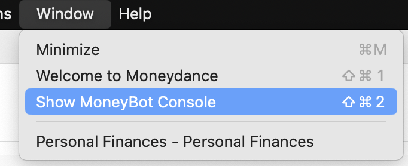
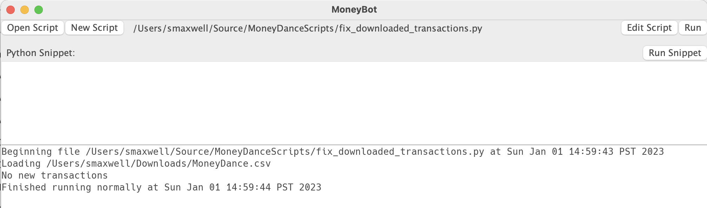

Fix Downloaded Transactions Extension
=====================================

When you have a lot of transactions, manually confirming them all after
download can be tedious and time-consuming. MoneyDance will sometimes make
incorrect guesses for the description. This Python extension will allow you
to create rules for automatically confirming transactions, allowing you to
set their description and category.

## Create your CSV File

To begin, you may want to just copy the `MoneyDance.csv` included here to your
`Downloads/MoneyDance.csv` folder. It has the correct heading and several
examples included. After you copy that file, it is easiest to open it with
Excel or Numbers.

## Running the Extension

Note: Although this code was originally designed to work as an extension,
since it is not signed, it generally works better in immediate mode where
you just run the code directly.

Download the code, then from MoneyDance, do `Window -> Show MoneyBot Console`
to show the Python console window. 

Then do `Open` and select the `fix_downloaded_transactions.py` file from the
downloaded code. 

Once it is loaded, you can hit the `Run` button as many times as you like.


In the above example, I was already up-to-date. If I then downloaded more
transactions, I could just hit `Run` again.

## Creating your own rules in the CSV file

Here is an example of what that file looks like, with a few additional entries
to better illustrate some options.

```csv
account_type,account_name,category,replacement,exact_match,starts_with,memo_contains,amount,amount_below,amount_above,skip_confirm
CREDIT_CARD,,Automotive:Fuel,76,,,,,,,
CREDIT_CARD,,Personal:Membership Dues,AAA Membership Renewal,,,,,,,
CREDIT_CARD,,Personal:Donations,ACLU,,,,,,,
CREDIT_CARD,,Vacation:Lodging,Airbnb,,,,,,,
CREDIT_CARD,,Vacation:Travel,Alaska Air,,Alaska A,,,,,
CREDIT_CARD,,Personal:Groceries,ALDI,,,,,,,
CREDIT_CARD,,Personal:Clothing,Banana Republic Factory,,BR FACTORY ,,,,,
CREDIT_CARD,,Personal:Clothing,Banana Republic Factory Online,,BR FACTORY.COM,,,,,
CREDIT_CARD,,Vacation:Travel,Budget Rent-a-Car,,Budget Rent A Car,,,,,Y
,Costco Anywhere Visa,Personal:Membership Dues,Costco Annual Membership Renewal,Costco Annual Membership Renewal,,,,,,
BANK,,Tax:State Income Tax,Franchise Tax Board,,ACH CREDIT FRANCHISE TAX BD,,,,,
BANK,,Tax:Federal Income Tax,Internal Revenue Service,,ACH CREDIT IRS TREAS,,,,,
CREDIT_CARD,,Automotive:Fuel,Love’s,,LOVE S COUNTRY,,,,,
CREDIT_CARD,,Automotive:Fuel,Love’s,,LOVES COUNTRY,,,,,
CREDIT_CARD,,Personal:Dining,Outback Steakhouse,,OUTBACK #,,,,,
,First Republic Bank,Rivian Loan,Payment,,ACH DEBIT USAA FSB,,-1534.18,,,
,First Republic Bank,PayPal,PayPal,,ACH CREDIT PAYPAL,,,,,
,First Republic Bank,PayPal,PayPal,,ACH DEBIT PAYPAL,,,,,
,First Republic Bank,PayPal,PayPal,,,,,,,
CREDIT_CARD,,Personal:Coffee Shop,Peet’s Coffee,Peet’s Coffee,PEET'S #,,,,,
CREDIT_CARD,,Personal:Coffee Shop,Peet’s Coffee,,PEETSCOFFEE/MIGHTYLEAF,,,,,
CREDIT_CARD,,Personal:Coffee Shop,Peet’s Coffee,,SAN PEETS COFFEE,,,,,
```

## What Are We Matching?

These rules are looking to match with the original "online" description. Often
MoneyDance will try to help you by changing the description to what it thinks
you probably want, but it can guess wrong. An online description will usually
be something ugly and bank-y like `ACH CREDIT IRS TREAS`. When you run the
extension, it will show info about all the transactions that it could not
match, and that will show the "online" description that you should use.

Other columns allow you to use the memo and the transaction amount to further
match.

All matching is case-insensitive. So `ACH Credit` will also match
`ACH CREDIT` and `ach credit`.

## Required(-ish) Fields

### `account_type` and `account_name`

You will usually have one of these two columns filled out, but you can leave
both empty if you have rules that could apply to any account.

If set, the `account_type` should be either `CREDIT_CARD` or `BANK`.

The `account_name` should be the name of an actual credit card or bank account
as you have specified it in MoneyDance. In the above example, you can see that
I have a few rules that apply only to my `First Republic Bank` or my
`Costco Anywhere Visa` accounts.

### `category`

You should always set this. Specify a category that you have already created
in MoneyDance, such as `Personal:Clothing`, or another account such as
`Rivian Loan` or `PayPal`.

### `replacement`

Always set this. This will specify exactly what you want the description to be
for this transaction.

## If You Stop There

In many cases, those will be the only columns you need to set. If you do not
set `exact_match` or `starts_with`, this rule will match any online description
that starts with your `replacement`.

## Columns for Specifying Matches

### `exact_match` and `starts_with`

If you set either of these, the transaction will _not_ automatically match the
`replacement`.

These do what you would expect. The `exact_match` will only match if the online
description is exactly what you have in this column. That can be very fragile
so you probably will prefer the `starts_with` column, which will match any
online description that starts with what you put in that column.

You can specify both, in which case it will match if either is true.

And remember that these are case-insensitive.

### `memo_contains`

Sometimes the only way to disambiguate a transaction is with extra information
contained in the `memo`. In my case, when I transfer money between my bank
accounts, the description is always the same, but the last 4 digits of the
account number is in the memo.

### `amount`

This will match if the amount of the transaction exactly matches this column.
Remember that charges are negative numbers. I have monthly payments for life
insurance for myself and my partner, and the only difference is the dollar
amount.

### `amount_below` and `amount_above`

I have found this useful in distinguishing between my paycheck, and when my
company is simply reimbursing my expenses.

## To Confirm or Not To Confirm

### `skip_confirm`

By default, this extension will confirm everything it matches. This is usually
what you want, but not always. For instance, when I rent a car, it is 50/50
whether this is a vacation expense, or a reimbursable business expense. In that
case, I just put a `Y` in this column so that it gets the description fixed,
but is not confirmed.

# For Developers

Before I wrote this code, I did quite a bit of work to make it easier to
write MoneyDance extensions in Python. I wrote `make_pyi.py` to inspect the
Python API and create the PYI files contained within the `com` folder. Those
PYI files give critical information to IDEs such as PyCharm that allow them to
understand the code you are writing.

If you want to write extensions in Python, you may want to either copy the
`com` folder to your own code's folder, or run `make_pyi.py` to be sure you
have all of the latest MoneyDance APIs.
